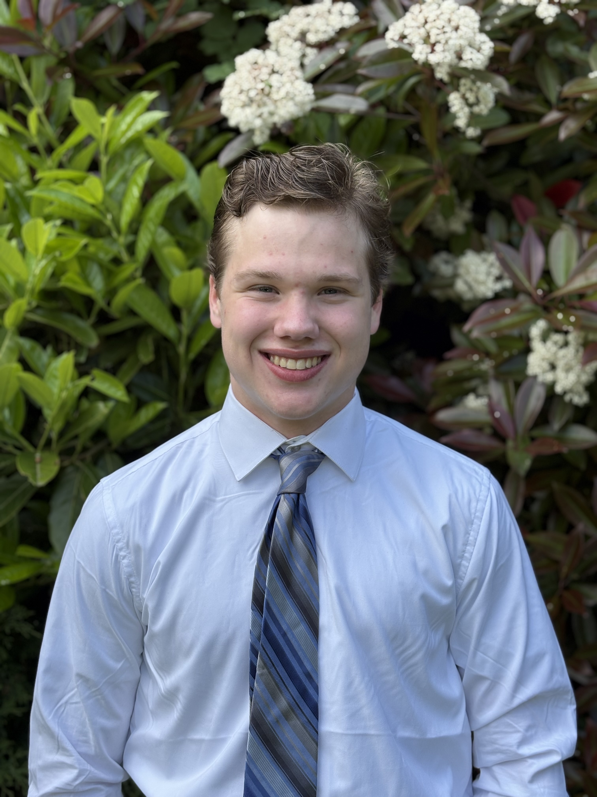

# Hello

Electrical Engineering student at Washington State University focused on **RF systems**, **embedded development**, **robotics**, and **digital logic**. I love to build low‑level systems with an emphasis on clarity, maintainability, simplicity, and hands‑on engineering.

---

## Technical Focus
+ **Embedded Systems** - ARM, C/C++, bare‑metal workflows  
+ **RF Engineering** - FCC ham technician certification in progress  
+ **Digital Logic & Hardware** - Verilog, FPGA workflows, hardware bring‑up  
+ **Robotics & Control** - microcontrollers, sensors, real‑time systems  
+ **Manufacturing** - CNC machining, 3D printing, mechanical integration  

---

## Featured Projects (Current)
+ **Monolithic ARM Kernel** [Kernel Project](https://github.com/GusBallmanjr/ARM-Monolithic-Kernel) - ARM based, Linux-inspired architecture, memory management, and scheduling
+ **Kevlar Encryption** [Encryption Project](https://github.com/mrthomaslibrary/kevlar-encryption) - Lightweight asymmetric encryption system
+ **WSU EE 234 Coursework** [EE 234 - Gus Ballman](https://github.com/GusBallmanjr/EE-234---Microprocessor-Systems---ARM-Assembly-and-C) - Embedded ARM Microprocessor Programmin in ARM Assembly and C

---

## What I’m Working On
+ RF experimentation & ham radio certification  
+ Expanding my kernel subsystems  
+ Lightweight cryptography modules  

---

## Programming Languages
+ **C**
+ **C++**
+ **Verilog**
+ **ARM Assembly**

---

## Contact
+ **General Github Link** [GusBallmanjr Github](https://github.com/GusBallmanjr)
+ **LinkedIn:** [LinkedIn](https://www.linkedin.com/in/gusballmanjr/)
+ **Portfolio** [Portfolio](https://docs.google.com/document/d/1Rha27cDPyCqS3UYorWfaFyIsLz7KRRIMj108fUmySow/edit?usp=sharing)
+ **Resume** [Resume](https://docs.google.com/document/d/13i5mefX-h9M8QtJCZFSq7OxY1a8pcCSkvOpbYp0FuUk/edit?usp=sharing)
+ **Email:** [Email](gusballmanjr@gmail.com)
+ **Devpost** [Devpost](https://devpost.com/gusballmanjr?ref_content=user-portfolio&ref_feature=portfolio&ref_medium=global-nav)

---

## Past Projects in Chronological Order (Newest at top)
+ **2026 CrimsonCode Hackathon** [OGRE Encryption - Precursor to Kevlar Encryption](https://github.com/GusBallmanjr/2026-CrimsonCode-Hackathon-OGRE-Encyrption-)
+ **WSU CptS 122 Final Project** [CptS 122 Final Project](https://github.com/GusBallmanjr/CptS-122-Data-Structures-WSU---Project-9)
+ **WSU EE 214 Coursework** [EE 214 - Gus Ballman](https://github.com/GusBallmanjr/EE-214-Design-of-Logical-Circuits--Verilog--)
+ **WSU CptS 122 Coursework** [CptS 122 - Gus Ballman](https://github.com/GusBallmanjr/CptS-122-Data-Structures-WSU)
+ **2025 CrimsonCode Hackathon** [Fractal Simulator](https://github.com/GusBallmanjr/2025-CrimsonCode-Hackathon)
+ **x86 Assembly Hello World** [x86 Hello World](https://github.com/GusBallmanjr/Assembly-Hello-World)
+ **WSU CptS 121 Coursework** [CptS 121 - Gus Ballman](https://github.com/GusBallmanjr/CptS-121-Program-Design-and-Development-C-WSU)
+ **First Program (Robotic Elevator)** [Vex Elevator Robotics Project Code](https://github.com/GusBallmanjr/Vex-Elevator-Robot-Code)
